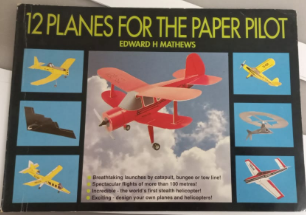

Note to readers:  This document is in Afrikaans.  Simply paste the contents into google translate in order to generate an English version.

There is an accompanying youtube video showing the making of the aircraft:

youtube link

# Prandtl Papier weergawe

Bou 'n papier weergawe van die Prandtl vliegtuig met 1.5 meter vlerkspan.  Dit is van baie stywe karton gebou.  Ondersoek of die beter styfheid minder defleksie onder las gee as die polistireen model.

Hierdie is ' n tussenstap tot 'n balsa hout model wat moontlik servos en stabiliasie het.  Dit kan opgevolg word met 'n vliegtuig met afstandbeheer en aandrywing.  Dit kan die massa parameters gee en sal ook wys of 'n plat plaat 'n goed genoeg profiel is vir kleiner modelle.

Gebruik die model om op 'n goedkoop wyse meer ervaring op te bou met die Prantl konfigurasie.  Ontwikkel ook FreeCAD metodes vir die modellering van die vliegtuig.

## Prandtl konsep

Prandtl veeg is deur verskeie iterasies van navorsers as 'n geometriese wringhoek teenoor span definieer in 'n patent.  Die grootste voordele is 'n optimum sleurkrag vir 'n sekere gewig (nie span nie) en korrektiewe giermoment wat gunstig is vir gier styfheid van 'n vliegtuig.

## Massa

Die papier materiaal van die vliegtuig weeg 129 gram.

Dit gee 'n afgeskatte gelykvlug spoed van minder as 10km/h teen 3 grade invalshoek.

Die massa van elke vlerk is 52 gram.  Papier is dus 693 gram/$m^2$.

## Aeroelastisiteit

Daar is aansienlike deurbuiging a.g.v. eie gewig vir die vlerk.  Daar word voorsien dat die gebrek aan buigstyfheid probleme gaan veroorsaak met aeroelastisiteit.

Defleksie sonder wringhoek is ongeveer 320mm.

Defleksie met wringhoek is xxx mm.

## Vlerkprofiel

Die vlerkprofiel is 'n plat plaat.  Dit is geskik omdat dit 'n simmetriese profiel is, maar het die nadeel dat dit swak buigstyfheid het.

Volgens "12 Planes for the Paper Pilot" se laaste iterasie is 'n plat plaat goed genoeg vir hierdie lae Reynolds getal papier vliegtuie.  Vroeër iterasies van Paper Pilot het gekromde vlerke gehad maar windtonnel toetse het getoon dat dit nie nodig is nie en dat die plat plaat vlerke selfs 'n aerodinamiese voordeel inhou.

Die Reynoldsgetal word afgeskat om laer as 25000 te wees.  Dus is 'n plat plat geskik.



## Tekeninge

Die vliegtuig is modelleer in FreeCAD weergawe 0.19 en met die hand oorgeteken op 'n karton papiervel wat 1mm dik is.  Die komponente is uitgesny met 'n skerp mes en met 'n deurskynende papier gom aanmekaar gegom.


## Neutrale punt berekening

Om die swaartepunt van die skets van die hefkrag verspreiding te kry, gebruik die volgende opdrag in die Python venster waar "Sketch018" die skets is met die hefkrag verspreiding.

```python
App.ActiveDocument.Sketch018.Shape.CenterOfMass
```


Die vergelyking vir die klokvorm hefkrag verspreiding is:
$$
\gamma_s(y) = \frac{32}{3 \pi AR} C_L \bigg(1 - \frac{y^2}{s^2} \bigg)\sqrt{s^2 - y^2}
$$


vanuit:

[US9382000B1 - Aircraft design - Google Patents](https://patents.google.com/patent/US9382000B1/en)

Dit is die Prandtl patent.

Die vlerkprofiel is 'n plat profiel want op die lae Reynoldsgetalle maak dit nie sin om 'n gekromde profiel te hê nie.  Dit is duidelik uit Paper Pilot boeke.  Die neutrale punt kan nou grafies bereken word as die projeksie van die swaartepunt van die hefkrag verspreiding op die kwartkoordlyn.  Die kwartkoordlyn is die plaaslike neutrale punt van die 2D vlerkprofiel en omdat die plat vlerkprofiel simmetries is het dit geen ander bydraende momente nie.

Neutrale punt is 18.6mm agter die agterpunt van vlerk in die vlak van simmetrie.


## Verwysings

1. Uber tragflugel kleinsten induzierten widerstandes, Zeitschrift fur flugtechnik und motorluftschiffahrt, Ludwig Prandtl, 1933
2. NASA/TP-2016-219072, On wing of the minimum induced drag:  Spanload implications for aircraft and birds, Al Bowers et al., March 2016.
3. NASA/TM-20210014683, Experimental flight validation of the Prandtl 1933 Bell Spanload, Al Bowers et al., July 2021.
4. US Patent US9382000B1 - Patent for the Prandtl type wing.
5. 12 Planes for the Paper Pilot, E.H. Matthews, Eerste uitgawe 1991.

