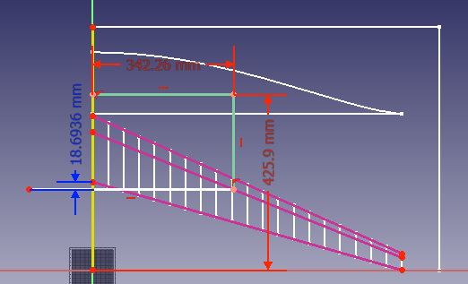

Note to readers:  This document is in Afrikaans.  Simply paste the contents into google translate in order to generate an English version.

There is an accompanying youtube video showing the making of the aircraft:

youtube link

# Prandtl Papier weergawe

Bou 'n papier weergawe van die Prandtl vliegtuig met 1.5 meter vlerkspan.  Dit is van baie stywe karton gebou.  Ondersoek of die beter styfheid minder defleksie onder las gee as die polistireen model.

Gebruik die model om op 'n goedkoop wyse meer ervaring op te bou met die Prantl konfigurasie.  Ontwikkel ook FreeCAD metodes vir die modellering van die vliegtuig.


## Neutrale punt berekening

Om die swaartepunt van die skets van die hefkrag verspreiding te kry, gebruik die volgende opdrag in die Python venster waar "Sketch018" die skets is met die hefkrag verspreiding.

```python
App.ActiveDocument.Sketch018.Shape.CenterOfMass
```


Die vergelyking vir die klokvorm hefkrag verspreiding is:
$$
\gamma_s(y) = \frac{32}{3 \pi AR} C_L \bigg(1 - \frac{y^2}{s^2} \bigg)\sqrt{s^2 - y^2}
$$


vanuit:

[US9382000B1 - Aircraft design - Google Patents](https://patents.google.com/patent/US9382000B1/en)

Dit is die Prandtl patent.

Die vlerkprofiel is 'n plat profiel want op die lae Reynoldsgetalle maak dit nie sin om 'n gekromde profiel te hê nie.  Dit is duidelik uit Paper Pilot boeke.  Die neutrale punt kan nou grafies bereken word as die projeksie van die swaartepunt van die hefkrag verspreiding op die kwartkoordlyn.  Die kwartkoordlyn is die plaaslike neutrale punt van die 2D vlerkprofiel en omdat die plat vlerkprofiel simmetries is het dit geen ander bydraende momente nie.

Neutrale punt is 18.6mm agter die agterpunt van vlerk in die vlak van simmetrie.

